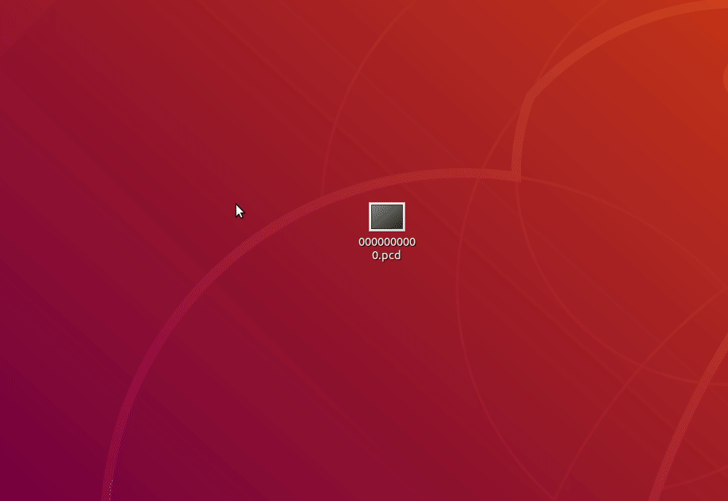

# Open3d viewer

This application is a simple pcd viewer from [intel-isl/Open3D](https://github.com/intel-isl) project.

Environment: Ubuntu 18.04

For installation please visit [release](https://github.com/HTLife/open3d_viewer/releases) page.

After the installation, you could double click to view the .pcd file.

